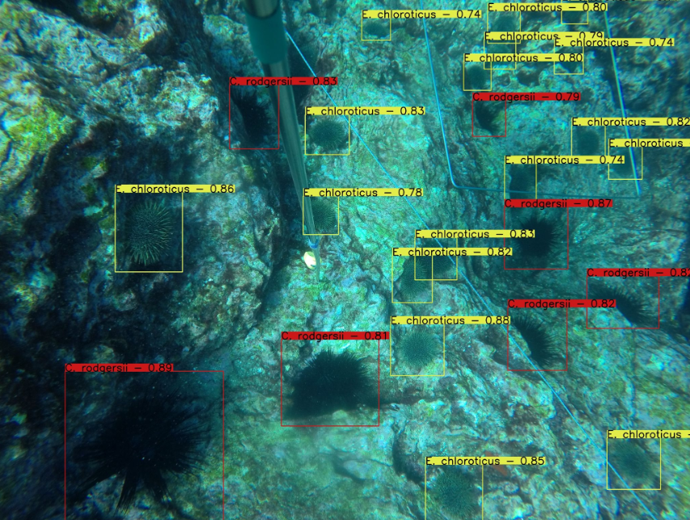

# Urchin-Detector
A repository for training, testing and analysing sea urchin object detection models. The current best model can accurately detect, classify, and locate three sea urchin species found in Australia and New Zealand.

*Example of a detection output from a trained model.*

**Performance on the test set:**
|         | P     | R     | F1    | mAP50 | mAP50:95 |
| ------- | ----- | ----- | ----- | ----- | -------- |
| **Kina** | 0.914 | 0.903 | 0.908 | 0.935 | 0.575    |
| **Centro** | 0.877 | 0.837 | 0.857 | 0.887 | 0.492    |
| **Helio** | 0.921 | 0.827 | 0.871 | 0.892 | 0.580    |
| **Average** | 0.904 | 0.856 | 0.879 | 0.905 | 0.549    |

*Evaluated with conf=0.45 and nms_iou=0.6*

## Repo Structure
The repository is structured as follows:

- **data:** Contains the various files, images and labels for the urchin dataset and relevant code for formatting and creating the dataset. See *data/data_documentation.md* for more information.
- **models:** Contains the models trained on the urchin dataset. Each folder in models contains a single model, which includes its weight file, hyperparameters and various figures and plots.
- **python:** Contains the code used to train, evaluate and analyse the models. See *python/documentation.md* for more information.
- **media:** Contains reports and images relevant to this project
- **yolov5:** This is a submodule of a fork of the [yolov5](https://github.com/ultralytics/yolov5) repository. This includes several minor modifications to the original code.

## Setup
After cloning this repository, you will need to set up your Python environment by installing the packages found in requirements.txt. This includes the requirements for yolov5 and the additional requirements for this repository. Pytorch and TorchVision are included in the requirements.txt file but should be installed separately (and before) using the instructions found [here](https://pytorch.org/get-started/locally/).

After this, you can set up the urchin dataset by following the instructions in *data/data_documentation.md*.

## Documentaiton
For documentation regarding the dataset and related code, see *data/data_documentation.md*. For documentation regarding the model analysis, evaluation, and other code, see *python/documentation.md*.