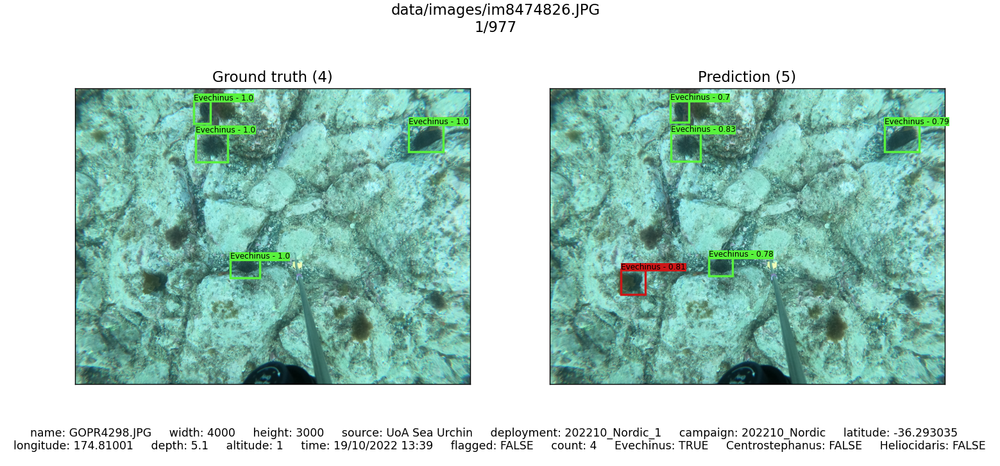

# UrchinBot Documentation
This documentation provides a quick overview of the code in this repository. We give a brief explanation of what each function, class and script does and what it is used for. For more details about each function and its arguments and output, refer to the doc strings in the code.

## Overview
1. **cvat:** contains scripts used for processing and analysing annotations from CVAT
    - **cvat_stats.py:** script that reads through a cvat XML annotation file and outputs some basic stats and metrics
    - **get_annotation.py:** contains a function for reading and formatting a cvat XML annotation file into a more readable dict
2. **urchin_utils:** contains various helper functions and utilities
   - **data_utils.py:** functions for reading and dealing with the dataset
   - **eval_utils.py:** functions for evaluating model performance and calculating metrics
   - **model_utils.py:** functions and classes for loading and using object detection models
   - **vis_utils.py:** functions for various ways of drawing and visualising model predictions
1. **analysis_tools.py**: uses components from urchin_utils to create more complex functions to analyse and evaluate models
2. **run_analysis.py**: script for running functions from analysis_tools
3. **train_urchin_model.py**: script for training a yolov5 model on the urchin dataset
4. **val_urchin_model.py**: script for validating/testing a yolov5 model on the urchin dataset

## Data Utils

```dataset_by_id(csv_path=CSV_PATH)```: Creates a dictionary of the dataset with the id as the key and the row (another dict) as the value. The dict is created using the formatted CSV specified by *csv_path*. The keys of the row dicts are the CSV headers (see *data/data_documentation.md*). The dictionary created by this function is the main way all other functions utilise ground truth data. Note that the boxes are stored as a string but using *ast.literal_eval(row["boxes"])* will convert the string to a list of tuples with each element having the correct data type.

```id_from_im_name(im_name)```: Extracts an integer ID from the image name (i.e. "im{id}.JPG"). Useful for finding the ID of the image for indexing a dataset dict.

```read_txt(images_txt)```: Reads in a text file of image paths and returns a list of image paths. Can be used to get all the images in the train, val or test split as these are stored as txts.

```process_images_input(images)```: takes either a txt file of image paths or a list of image paths and returns a list of image paths. This is used so other functions can receive images in either format as input and process them the same way.

```complement_image_set(images0, images1)```: returns a list of all the image paths in images1 that are not in images0.

```filter_images(image_paths, dataset, label="all", filter_var=None, filter_func=None, limit=None)```: Filters a txt or list of image path and returns a list. Setting *label* to one of "all", "empty", "urchin", "kina", "centro", or "helio" allows for a simple way of broadly filtering the images. *fitler_var* and *filter_func* allow for a more fine-grained filtering of the images. This is useful when you want to analyse a small subset of the dataset.

## Evaluation Utils

```iou_matrix(boxes1, boxes2)```: creates a matrix of the IoU values between all boxes in boxes1 and boxes2. Each row of the matrix corresponds to a box in boxes1, and each column corresponds to a box in boxes2. Uses the yolov5 iou function.

```match_preds(gt, preds, iou_th=0.5)```: matches bounding box predictions to the ground truth data and determines the correctness of predictions (at the specified IoU threshold). Returns a bool array indicating which predictions are correct and a matrix of index pairs of the correct matches.

```correct_predictions(gt_boxes, pred, iou_val = 0.5)```: determines what predictions are correct and which ground truth boxes were missed at the specified iou thresholds. Returns two bool arrays.

```get_metrics(model, image_set, dataset, min_iou_val = 0.5, max_iou_val = 0.95, num_iou_vals = 10)```: Runs the model on the given image set and computes precision, mean precision, recall, mean recall, f1 score, ap50, map50, ap, and map. Uses code from yolov5.

```print_metrics(precision, mean_precision, recall, mean_recall, f1, ap50, map50, ap, map, classes, counts):```: prints the output of *get_metrics* in a table.

```validiate(model, images, dataset)```: this is the main function to call when you want to evaluate a model. It runs the model on the provided images and prints the metrics.

## Model Utils

**Constant Variables:** model_utils defines several constant variables that can be useful when working with object detection models. *NUM_TO_LABEL* is a list that can convert a class ID (i.e. a number, 0, 1 or 2) into a species label. *LABEL_TO_NUM* is a dictionary that can do the opposite, i.e. a label (i.e. "Evechinus chloroticus") into a class ID. These can be used to convert back and forth between different representations of class labels. They are also used by other functions in the repo to determine the possible classes the model can predict, so if you use a different model that predicts a different range of species, you will need to update these variables. Lastly, *WEIGHTS_PATH* is used as the default best model path. 

```project_sys_path(depth=1)```: This adds the yolov5 folder to the system path so that other functions can be imported from the yolo repo. *depth* should be set to the depth of the python file running *project_sys_path* relative to the yolov5 folder. For example, if the script you run is in *python*, *depth* should be 1. If it was in *python/urchin_utils*, *depth* should be 2. 

```check_cuda_availability()```: Prints some basic information about cuda availability on the computer you are running on.

```load_yolov5_model(weights_path=WEIGHTS_PATH, cuda=True)```: Loads and returns a yolov5 model object from the given path. *cuda* should be set to True if you want to load the model on the GPU. The object returned is an instance of the *AutoShape* class, found in *yolov5/models/common.py*.

**Class - Detection**: The detection class is used to provide an amorphous representation of the output from an object detection model that can easily be converted to whatever form is necessary. This ensures that functions that run the models do not have to worry about the output format from the models. For each type of model (e.g. yolov5, yolox), a subclass is created that converts the raw model output into a list of np arrays of the form [x_center, y_center, w, h, conf, class] in pixels. This class supports indexing, iterating, and the *len* method to return the number (as if it were a list itself) but only in the xywhcl format. To iterate over bounding boxes in a different format, use the *gen* method.

**Methods:**
- ```convert_pred_to_array(self, pred)```: converts the output from a model to a list of np arrays of the form [x_center, y_center, w, h, conf, class] in pixels. It should be implemented in each subclass.
- ```xywhcl(self, index)```: returns a single box as an np array of the form [x_center, y_center, w, h, conf, class] in pixels.
- ```xyxycl(self, index)```: returns a single box as an np array of the form [x_top_left, y_top_left, x_bottom_right, y_bottom_right, conf, class] in pixels.
- ```gen(self, box_format="xywhcl")```: A generater function that allow you to iterate over the boxes in the chosen format. Used as if it were a iterable i.e. *for box in detection.gen(format=xyxycl):*.

**Subclasses:**
- ```Detection_YoloV5(Detection)```: Subclass of Detection for yolov5 models
- ```Detection_YoloX(Detection):```: Subclass of Detection for yolox models


``` gt_to_detection(gt_row)```: Converts a dict row from the ground truth dataset (i.e. a row from *dataset_by_id()*) into a detections object. 


**Class - UrchinDetector**: This class acts as a wrapper for object detection models to ensure uniform input and output for all other functions. Technically, there is no UrchinDetector class from which other subclasses inherit, as each subclass needs to implement every method differently, and for Python, inheritance is not required for polymorphism. Instead, there is just one class for each model that can be thought of as a subclass of the *UrchinDetector* class. Currently, this includes *UrchinDetector_YoloV5* and *UrchinDetector_YoloX*. Support for additional object detection models can be added by creating new UrchinDetetor classes and implementing all the necessary methods.

**Methods:**
- ```__init__(self, weight_path=WEIGHTS_PATH, conf=0.45, iou=0.6, img_size=1280, cuda=None, classes=NUM_TO_LABEL):```: The init method is responsible for loading the model and setting the necessary parameters. This method signature is an example of the yolov5 implementation of the UrchinDetector and uses the appropriate default values for all arguments. *cuda* can be set to True/False to enable/disable loading the model on the GPU, or if it is set to None, then the model will be loaded on the GPU if cuda is available. *classes* is a list of classes that the model detects.
- ```update_parameters(self, conf=0.45, iou=0.6)```: Updates the confidence and nms iou thresholds for the model.
- ```predict(self, im)```: Runs the model on the image and returns the model prediction as a detection object.
- ```__call__(self, im)```: Shorthand for calling the predict method.

## Visualisation Utils

```draw_bbox(ax, bbox, colour)```: Draws a single bounding box of the form xywhcl on the provided matplotlib axis.

```determine_box_colour(label, correct, missed)```: Returns a hex colour code based on the species label. Alternatively, the colour will be green if *correct* is true or *missed* is false. The colour will be red if *correct* is false or *missed* is true. If both are None, then the species-specific colour is used.

```draw_bboxes(ax, bboxes, correct=None, boxes_missed=None)```: Draws all the boxes in the provided detection object onto the matplotlib axis. *correct* and *missed* are lists of bools that indicate if the prediction is correct or missed. This is used for determining box colour. If they are left as None, then the species-specific colour is used.

```plot_im_and_boxes(im, boxes, axis, correct=None, boxes_missed=None)```: Plots an image and bounding boxes onto a matplotlib axis

```annotate_image(im, bboxes, thickness=2, font_size=0.75, draw_labels=True)```: Uses open cv to draw bounding boxes and labels onto an image. This should be used (instead of the matplotlib methods) if the image needs to be saved. Note that the line thickness and font size in open cv do NOT scale with image size, so you will need to adjust these accordingly.

```annotate_preds_on_folder(model, input_folder, output_folder, draw_labels=True)```: Runs the model on all images in a folder and saves the annotated images to a new folder.

## Analysis Tools
```compare_to_gt(model, images, dataset, label = "urchin", save_path = False, limit = None, filter_var = None, filter_func = None, display_correct = False, iou_val = 0.5) ```: Loops through the provided images and displays a figure comparing model predictions to the ground truth boxes. This is the main tool used for inspecting and analaysing model predictions. If *display_correct* is set to True, then the figure will show detected urchins and true predictions in green and missed urchins and false predictions in red. Otherwise, all boxes will be drawn in species-specific colours. For more information on the parameters, see the *compare_to_gt* docstring. Below is an example of what the figures produced by this function look like (with *display_correct* set to True):



```compare_models(model1, model2, dataset, images, label = "urchin", limit = None, filter_var = None, filter_func = None)```: creates figures like *compare_to_gt* except two lots of model predictions are shown, one for each model. This can be used to compare the performance of two models on the same images.

```bin_by_count(model, images, dataset, bin_width, seperate_empty_images=False)```: This bins images by the number of urchins in the image and calculates then prints metrics on each bin. This is useful for understanding how the quantity of urchins in an image affects the model's performance.

```calibration_curve(model, images, dataset, conf_step=0.1)```: Creates a calibration curve plot to show how prediction confidence relates to true accuracy. This is done by binning predictions by confidence and then determining the proportion of correct predictions in the bin. Ideally, this curve should be a straight line, with predicted confidence being exactly equal to true accuracy. In reality, the curve is often s-shaped, indicating underconfidence with high conf predictions and overconfidence with low conf predictions.

```save_detections(model, images, output_csv)```: saves model predictions of a set of images to a CSV with each row being one bounding box. Used if detections need to be saved permanently or used in other software.

```metrics_by_var(model, images, dataset, var_name, var_func = None)```: uses a variable from the dataset (see *data/data_documentation.md*) to separate the data into bins and prints metrics for each bin. This can be used to see how the model's performance changes with different variables in the dataset. For example, with *var_name="source"*, images will be separated by location, which shows that certain subsets of the dataset perform better than others.


